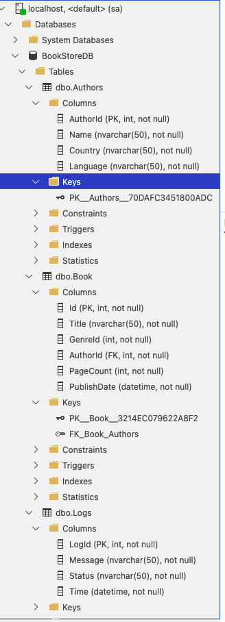
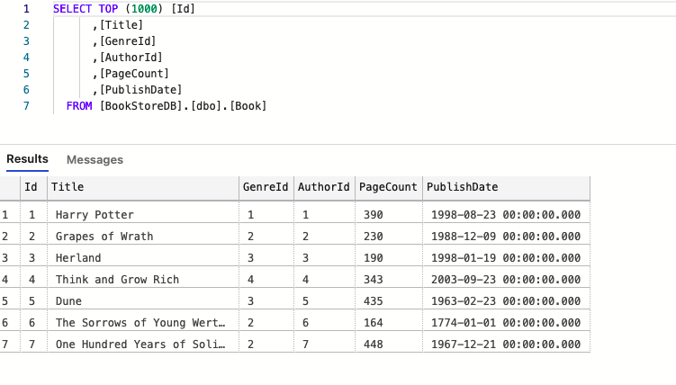
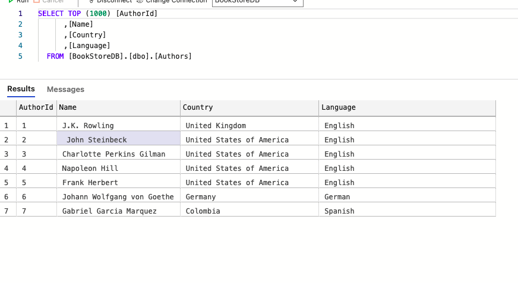
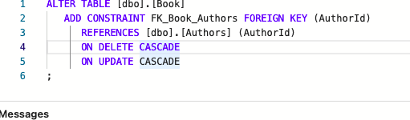
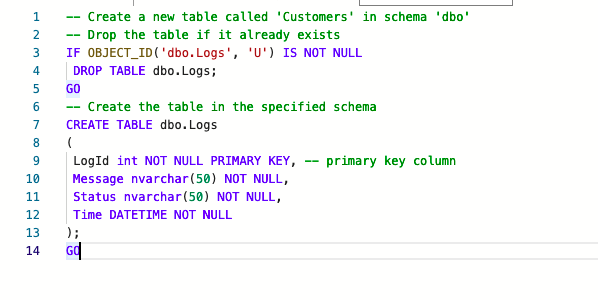

# Week3 - SQL Database Manual Entry Homework
---
>This week, created a database for BookStore WebApi project and created  tables for the log and models(Books and Authors). Additionally,  loadad the .bak extension file of the database that created in SQL Server in Azure Data Studio and added the logging and  result messages to current project.
---

>Azure Data Studio does not support the schema diagrams so I was not able to show tables and their relationships between. 
---
1. **All Created Tables**
The folder tree shows the three tables created under BookStoreDB. Tables are Book, Authors and Logs.

2. **Book Table**
The entries in Book table shown below. Book table has attributes such as :
-Id(Primary key)
-Title(Book's name)
-AuthorID(Foreign key, to connect with Authors table)
-PageCount
-PublishDate

2. **Authors Table**
The entries in Authors table shown below. Authors table has attributes such as :
-AuthorID(Primary key, to connect with Book table)
-Name(Author's name)
-Country (of Author)
-Language(Native Language of Author)

3. **To Connect Two Tables with Foreign Key**

4. **To Create Logs Table**
Logs model holds the id, status, message and the time of a http request and it's answer.

