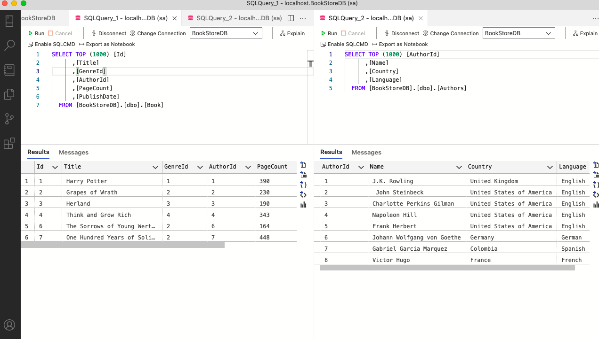
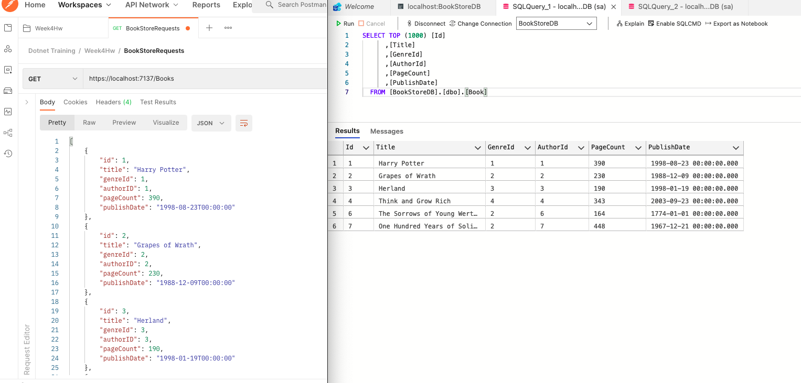
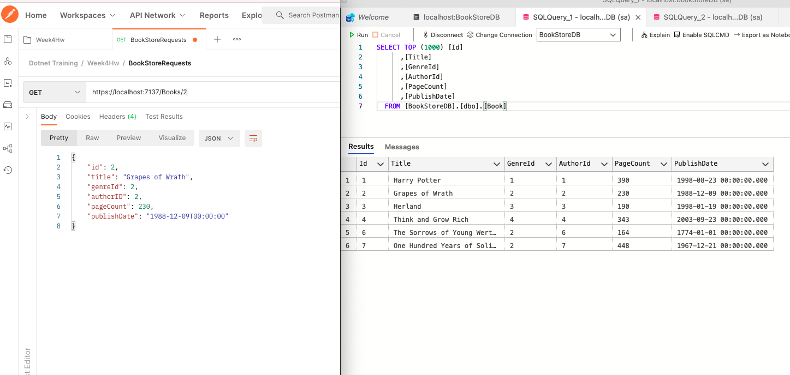
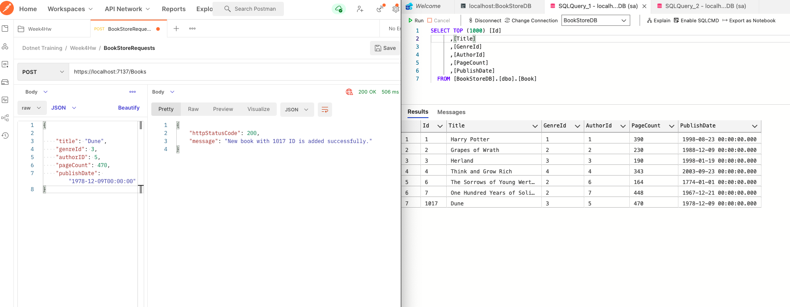
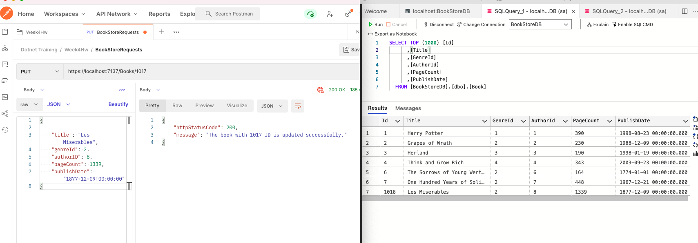
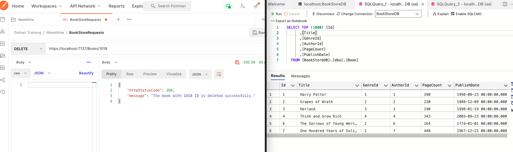

# Connecting Web Api Project with Database

-----
>This week, old Web Api which was using static data transformed into a dynamic one. By connecting SQL Server on  Azure Data Studio, the CRUD operations are handled using the database.
---
>Created Data Access Layer(DAL) folder to keep models and EFLibCore(Entities) folder to connect database with BookStoreDbContext file. Also, added the DBOperations to Controllers to perform operations on the database and rewrite the CRUD methods under BookController according to this.
---
>Tested the HTTP Requests with BookStoreApi and Postman and added screenshots of request answers on Postman and corresponding tables on the database.
###CRUD Operations 

1. All books and authors data on the database

2. HTTP Get Request and Database after the request

3. HTTP Get By ID Request and Database after the request

4. HTTP Post Request and Database after the request

5. HTTP Put Request and Database after the request

6. HTTP Delete Request and Database after the request

